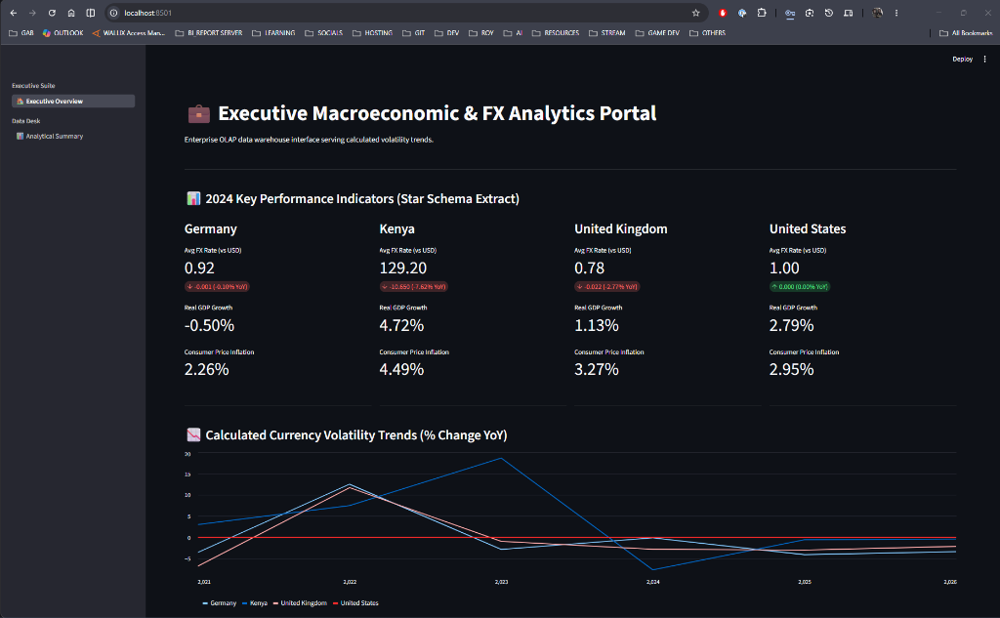
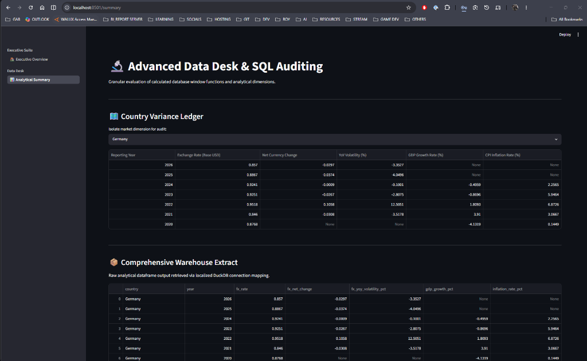
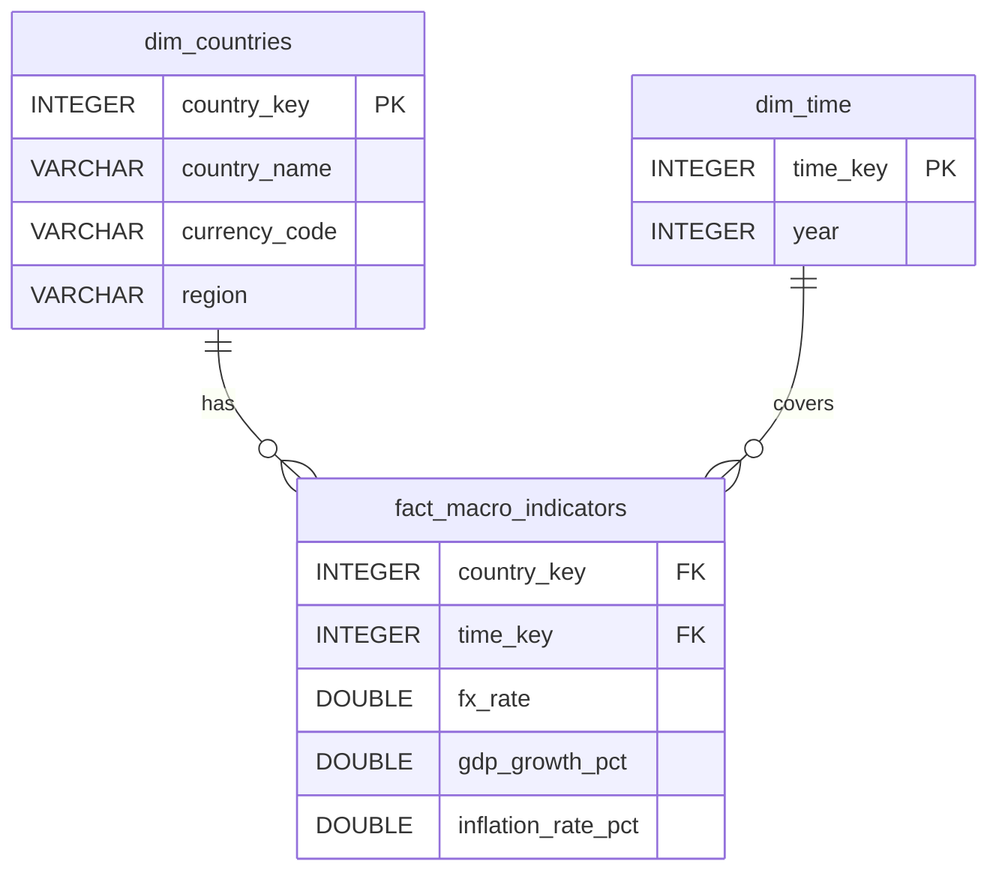

# 🌍 Global Market Intelligence Hub

An enterprise-grade OLAP data warehouse and analytical reporting portal built to ingest, stage, and analyze key macroeconomic indicators and foreign exchange (FX) rates across global regions. The platform runs a robust Python-based Extract-Transform-Load (ETL) pipeline, models the structured datasets using a dimensional star schema in an embedded **DuckDB** database, and serves interactive business visualizations and audit ledgers using **Streamlit**.

---

## 📸 Interface Preview

### 🏠 Executive Suite Overview
Displays the key performance indicators (KPIs) for the latest performance period (2024)—including Average FX Rate (vs USD), Real GDP Growth Rate, and Consumer Price Inflation—for Germany, Kenya, United Kingdom, and United States. It also includes an interactive chart illustrating historical YoY currency volatility trends.



### 📊 Data Desk & SQL Auditing
Features the interactive "Country Variance Ledger" where users can isolate and audit indicators for a selected market dimension, view the complete physical database extract, and download the dataset as an engineered CSV file.



---

## 🛠️ Architecture & Tech Stack

The application utilizes a modular, decoupled architecture consisting of an analytical database layer and an interactive dashboard reporting interface.

- **Frontend Interface**: [Streamlit](https://streamlit.io/) (entry point in [src/app.py](file:///c:/Users/gitongaR01/OneDrive%20-%20gab.co.ke/Data%20&%20Analytics/Data%20&%20IT%20Dev/Repos/Personal/github/GlobalFinanceHub/src/app.py))
- **Analytical & Storage Engine**: [DuckDB](https://duckdb.org/) (integrated in [src/engine.py](file:///c:/Users/gitongaR01/OneDrive%20-%20gab.co.ke/Data%20&%20Analytics/Data%20&%20IT%20Dev/Repos/Personal/github/GlobalFinanceHub/src/engine.py))
- **Data Engineering & Wrangling**: [Pandas](https://pandas.pydata.org/)
- **External API Ingestion Sources**:
  - **FX Currency Rates**: [Frankfurter API](https://www.frankfurter.app/) (Historical rates for EUR, GBP, USD vs USD)
  - **Macroeconomic Indicators**: [World Bank API](https://data.worldbank.org/) (Real GDP Growth: `NY.GDP.MKTP.KD.ZG`, CPI Inflation Rate: `FP.CPI.TOTL.ZG`)
  - **Fallback Patching**: Offline data patcher for Kenyan Shilling (KES) rates since KES is not supported on the standard Frankfurter endpoint.

---

## 📐 Data Warehouse Dimensional Schema (Star Schema)

The storage layout inside [macro_warehouse.duckdb](file:///c:/Users/gitongaR01/OneDrive%20-%20gab.co.ke/Data%20&%20Analytics/Data%20&%20IT%20Dev/Repos/Personal/github/GlobalFinanceHub/data/macro_warehouse.duckdb) conforms to a dimensional Star Schema designed to facilitate low-latency OLAP queries and straightforward dashboard reporting.



### Table Structure
1. **`dim_countries`** (Dimension Table): Houses country dimensions, standard currency codes, and geographic region names.
2. **`dim_time`** (Dimension Table): Tracks temporal reporting dimensions from year 2020 through 2026.
3. **`fact_macro_indicators`** (Fact Table): Links country and time keys to capture physical macroeconomic measures (FX rates, GDP growth %, inflation %).

---

## ⚙️ ETL Ingestion Pipeline

The ETL pipeline logic resides entirely in [src/engine.py](file:///c:/Users/gitongaR01/OneDrive%20-%20gab.co.ke/Data%20&%20Analytics/Data%20&%20IT%20Dev/Repos/Personal/github/GlobalFinanceHub/src/engine.py):

1. **Extract**:
   - Queries historical FX exchange rates via HTTP requests to the Frankfurter API.
   - Fetches GDP growth and Consumer Price Index (CPI) inflation rates from the World Bank API.
   - Applies offline data interpolation for KES (Kenya).
2. **Transform**:
   - Joins extracted JSON dataframes into a standardized tabular structure aligned by year.
   - Replaces missing indicator values with SQL-friendly `None` values and filters out temporal anomalies.
   - Maps country and year records to their corresponding surrogate keys from the dimensional tables.
3. **Load**:
   - Performs database `INSERT OR REPLACE` actions to populate the `fact_macro_indicators` table, ensuring idempotency.

---

## 📈 Advanced Analytics & SQL Auditing

The portal uses advanced SQL window functions to calculate year-over-year relative performance directly inside the database layer:

```sql
SELECT 
    c.country_name as country,
    t.year as year,
    f.fx_rate,
    f.fx_rate - LAG(f.fx_rate, 1) OVER (PARTITION BY c.country_name ORDER BY t.year) as fx_net_change,
    ((f.fx_rate - LAG(f.fx_rate, 1) OVER (PARTITION BY c.country_name ORDER BY t.year)) / LAG(f.fx_rate, 1) OVER (PARTITION BY c.country_name ORDER BY t.year)) * 100 as fx_yoy_volatility_pct,
    f.gdp_growth_pct,
    f.inflation_rate_pct
FROM fact_macro_indicators f
JOIN dim_countries c ON f.country_key = c.country_key
JOIN dim_time t ON f.time_key = t.time_key
ORDER BY c.country_name, t.year DESC;
```

### Calculated Columns:
- **Net Currency Change**: Measures the absolute shift in exchange rates relative to the prior period using `LAG()`.
- **YoY Volatility (%)**: Computes the percentage change in the exchange rate compared to the previous reporting year.

---

## 📂 Project Structure

```
GlobalFinanceHub/
├── assets/                          # UI screenshots referenced in documentation
│   ├── executive_overview.png
│   └── analytical_summary.png
├── data/                            # Embedded data store folder
│   └── macro_warehouse.duckdb       # Analytical columnar database (DuckDB)
├── src/                             # Project source code
│   ├── views/                       # Streamlit sub-pages (UI routing)
│   │   ├── overview.py              # Executive KPIs and volatility charts
│   │   └── summary.py               # Country audit ledgers and data downloader
│   ├── app.py                       # Global dashboard configuration and navigation routing
│   └── engine.py                    # ETL routines, database initialization, and OLAP query runner
└── requirements.txt                 # Project library requirements
```

---

## 🚀 Getting Started

### 1. Prerequisites
Ensure you have **Python 3.8+** installed.

### 2. Installation
Clone the repository and install dependencies listed in [requirements.txt](file:///c:/Users/gitongaR01/OneDrive%20-%20gab.co.ke/Data%20&%20Analytics/Data%20&%20IT%20Dev/Repos/Personal/github/GlobalFinanceHub/requirements.txt):
```bash
pip install -r requirements.txt
```

### 3. Run the ETL Pipeline
To initialize the DuckDB database file, create the tables, and fetch the latest API data:
```bash
python src/engine.py
```

### 4. Run the Dashboard Application
Launch the Streamlit server:
```bash
streamlit run src/app.py
```
This will output a local network URL (typically `http://localhost:8501`). Open this address in your web browser to interact with the portal.
